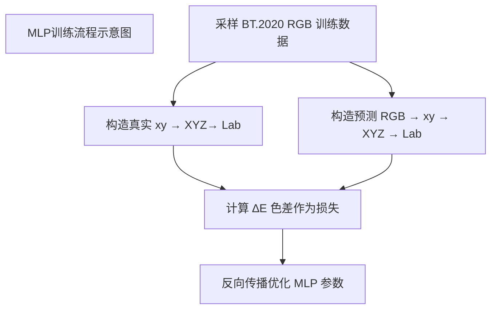
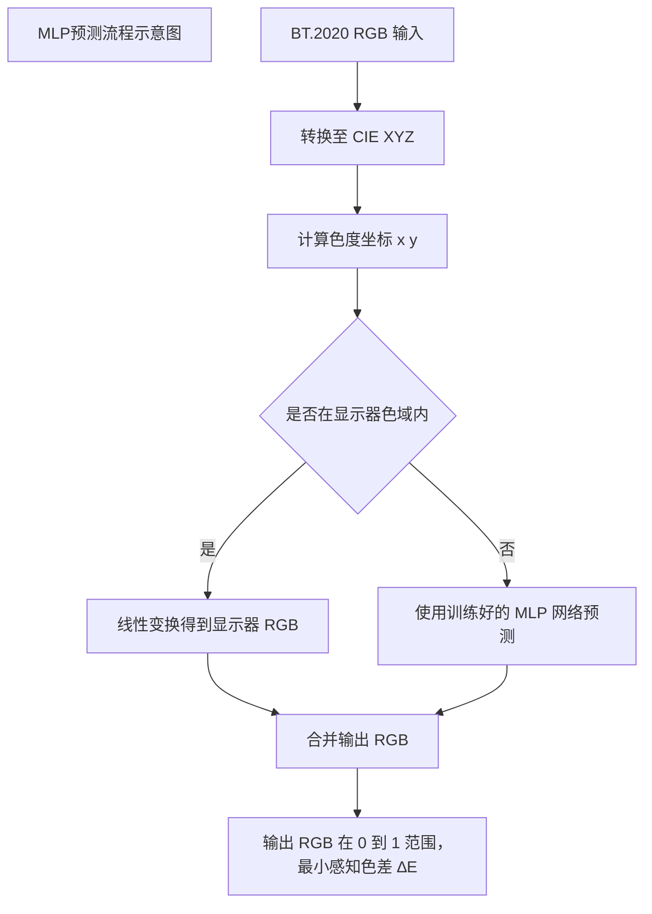
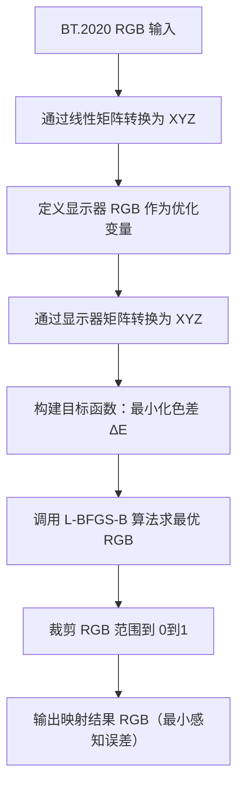
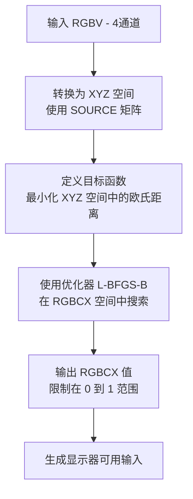
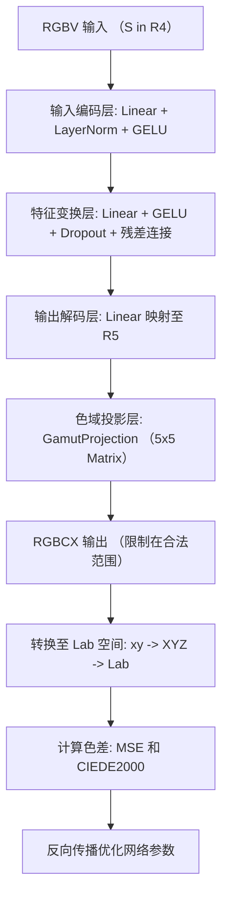
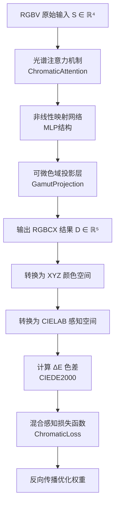
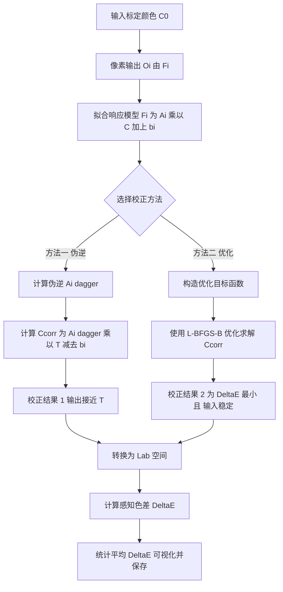

# LED 显示屏颜色转换与校正优化

团队：

2025 年 5 月11 日

**摘要**

随着超高清内容与多基色显示硬件的普及，传统 LED 显示屏在色域覆盖与像素一致性方面暴露出明显短板。针对 BT.2020 视频源到普通 RGB 显示屏的映射不足、四通道 RGBV 信号到五通道 RGBCX 显示的非线性失真，以及像素级色度漂移三大痛点，本文构建了相应数学建模框架。

1. **问题 1（BT.2020 → RGB）**
    基于 CIE 1931 色度图，先给出感知色差驱动的损失函数，再提出两套互补方案：

   - **方法 1**：多层感知机（MLP）学习非线性残差，快速逼近映射；
   - **方法 2**：以 L-BFGS-B 为核心的逐点约束优化，确保映射结果处于可显示域并最小化 ΔE00_{00}00。

2. **问题 2（RGBV → RGBCX）**
   针对四通道 RGBV 视频源向五基色 RGBCX LED 显示系统的映射，本文提出三种方案：

   + **数值优化法**：先建立 RGBV 与 RGBCX 各自的三刺激矩阵，将输入颜色投影至 CIE XYZ 空间，再以 L-BFGS-B 在 [0,1]^5 域内逐点搜索最小化 ΔE00_{00}00 的输出向量，实现高保真但计算量较大的基准映射。

   + **基础 MLP 模型**：构建 4 → 5 的多层感知机，并在尾部嵌入可微色域投影层，对网络输出进行域内裁剪；以 MSE 与 ΔE00_{00}00 联合损失训练，获得实时性更优的非线性映射函数。

   + **增强型注意-投影网络**：在 MLP 框架中引入光谱注意力加权，联合可微 5 × 5 投影矩阵与混合感知损失（xy-MSE + Lab-ΔE00_{00}00），并配合色域边界采样与噪声增强策略，显著提升色域外颜色的预测精度与模型泛化能力。

3. **问题 3（LED 像素校正）**
    在像素级拟合局部线性响应 $F_{i,j}(C)=A_{i,j}C+b_{i,j}$​ 的基础上，提出：
   - **伪逆线性回归校正**：一次计算反演输入，效率高；
   - **带正则的最小二乘优化**：兼顾输出一致性与输入平稳性。
      两种策略共同将 64 × 64 像素矩阵最大 CIEDE 2000 色差 $\Delta E_{00}$​ 压缩至 1.0 以内，显著提升像素显示真实颜色的能力。

**关键词**

 颜色空间转换；RGBV-RGBCX 映射；数值优化；多层感知机；光谱注意力；可微投影约束；感知色差；LED 显示屏颜色校正

# **1** **问题重述**

## **1.1** **问题背景**

现代显示技术面临着色彩保真度与设备限制之间的核心矛盾。从数学视角来看，这一问题本质上是高维色彩空间到低维显示空间的非线性映射优化问题。基于CIE1931标准建立的色度学体系，为色彩表征提供了严格的数学框架，但不同显示标准间的色域差异导致了映射过程中的信息损失。特别是当源色彩空间（如BT2020）与目标显示设备（如RGB LED）存在维度不匹配时，传统线性变换方法难以保持视觉感知的一致性。此外，多通道显示系统的引入（如RGBV到RGBCX的转换）进一步增加了问题的维度，使得色彩再现问题转化为一个高维空间中的约束优化问题。制造工艺带来的器件非均匀性则表现为像素级参数扰动，需要通过统计校正方法加以补偿。这些挑战共同构成了一个典型的数学建模问题：如何在有限维度的显示约束下，通过优化算法实现感知最优的色彩再现。本研究尝试从数学建模的角度，探讨颜色空间转换与校正算法的优化方法，希望在现有硬件基础上能对LED显示屏的色彩还原精度有所提升。虽然研究还存在许多不足，但我们期待这些初步探索能为显示技术的改进提供一些参考，也为相关领域的工程实践带来一点启发。

## 1.2 问题提出
本研究需要解决三个数学优化问题：

1. 降维映射问题：将高色域的BT2020三维色彩空间最优地映射到常规RGB显示空间，构建基于感知度量的目标函数；
2. 高维转换问题：实现从四通道(RGBV)到五通道(RGBCX)的色彩空间转换，在扩展的维度空间中最大化色域覆盖率；
3. 参数校正问题：针对LED器件的随机偏差，建立像素级的非线性校正模型，消除空间不均匀性；

这些问题本质上都属于数值优化范畴：前两者关注色彩空间的度量保持映射，第三个属于参数估计问题。解决这一系列问题需要融合色度学几何、矩阵分析和统计优化，神经网络等方法，构建从理论到应用的完整数学框架。

# 2 问题分析

1. 在本项目中，我们需连续解决 **色域降维映射（BT.2020 → RGB）**、**维度提升映射（RGBV → RGBCX）** 以及 **像素级颜色校正** 三大子问题。三者既可拆分为相对独立的数学建模任务，又因统一的显示链路而高度耦合。若要在真实硬件约束下获得**高保真、低偏差、均匀一致**的 LED 显示效果，必须从 **色度学几何、信号处理理论、统计优化** 和 **工程可实现性** 等维度统筹考量其难点与内在联系。下文对各子问题的挑战与关键技术点作进一步梳理。

   ### 2.1 色域降维映射（BT.2020 → sRGB）

   | 挑战               | 关键要点                                                     |
   | ------------------ | ------------------------------------------------------------ |
   | **色域包络差异**   | BT.2020 三基色顶点位于 CIE-1931 马蹄曲线近外缘，而普通 LED sRGB 色域包络显著更小，高饱和度红-绿-蓝点在投射后落到目标色域之外。需设计压缩/投影策略并抑制伪色。 |
   | **感知度量非对称** | 人眼对不同色相、亮度、饱和度的敏感度差异显著。简单的 xyxyxy 欧氏距离或 RGB 误差不足以刻画主观视觉损失，需采用 ΔE00\Delta E_{00}ΔE00 等符合视觉心理学的指标构建损失函数。 |
   | **物理可逆性约束** | 硬件亮度限幅与 γ-EOTF 使得降维映射不能仅依赖线性矩阵，需在 Tone-Mapping 阶段加入亮度压缩与 γ 反校正，保证黑场细节与高光不过曝。 |

   

   ### 2.2 维度提升映射（RGBV → RGBCX）

   | 挑战                 | 关键要点                                                     |
   | -------------------- | ------------------------------------------------------------ |
   | **自由度与约束失衡** | 4 维输入 → 5 维输出看似自由度增加，但 RGBCX 基色光谱并非完全线性独立；同时需维持能量守恒和色度一致性，实际可行解空间被显著收缩。 |
   | **色域重叠与缺洞**   | RGBV 与 RGBCX 色域在 CIE-1931 平面存在交叠区与空洞区： • 交叠区可用线性或加权组合逼近。 • 空洞区颜色需沿法向投影到 RGBCX 可显示边界，引入饱和度损失／色相偏移风险。 |
   | **通道亮度归一化**   | V、C、X 三个非传统基色对明度 YYY 的贡献权重不一；不加归一化会导致映射后对比度与灰阶层次非线性扭曲。 |
   | **数值稳定性**       | 5 × 4 基色三刺激矩阵 M4→5M_{4\to5}M4→5 条件数可能较大，需正则化或 SVD-剪裁避免微小测量噪声放大。 |

   

   ### 2.3 像素级颜色校正（64 × 64 LED 面板）

   | 挑战                 | 关键要点                                                     |
   | -------------------- | ------------------------------------------------------------ |
   | **制造误差统计分布** | R/G/B 发光芯片在主峰波长、半高宽及驱动灵敏度上存在 **趋势漂移**（批间温控、老化）与 **随机离散**（工差）。需先采样颜色，拟合每像素 3 × 3 线性响应矩阵。 |
   | **像素响应数据不足** | 每像素仅有一个在目标 RGB 输入下输出的带色差 RGB 值，无法通过大量数据拟合复杂非线性响应函数或响应神经网络，需应用局部线性响应假设拟合响应函数。 |
   | **多重映射误差叠加** | 上游两级映射已引入色差；若校正算法仅消除像素响应误差而忽视前端投影误差，整体 ΔE 仍不可控。需将“映射 + 校正”联合优化作为整体最小化目标。 |
   | **非线性响应线性化** | 在 RGB 和 XYZ 色彩空间之间切换，利用 XYZ 空间的线性特性简化校正过程。在校正过程中，确保所有计算都基于同一个色彩空间（如 XYZ）。 |

# **3** **模型建立与求解**

## **3.1.1 问题 1 求解思路**

本问题聚焦于从标准视频源的 BT.2020 色彩空间映射至普通 LED 显示器有限色域（如 sRGB 或厂商自定义 RGB）的过程，目标是在尽可能保留原始视觉感知的前提下，构建一个映射函数以最小化色彩转换带来的视觉误差。由于 BT.2020 色域远大于显示器色域，部分颜色在物理上无法直接还原，因此需要设计一个带约束的颜色映射机制，以确保输出 RGB 值在 $$[0,1]^3 $$范围内可被硬件显示，同时在感知层面尽可能贴近原始色彩。

为系统性解决该问题，本文基于色彩感知一致性与显示器色域约束两个核心原则，设计了以下两种代表性映射策略：

#### 方法一：基于神经网络的非线性映射拟合

整体流程包括：

- 构建 BT.2020 和 LED 显示器的原色 XYZ 转换矩阵；
- 对处于共同色域（交集区域）的颜色，直接通过线性矩阵转换；
- 对超出色域的颜色，则通过预训练的 MLP 网络预测目标 RGB 值；
- 训练阶段使用色度坐标转换 (xy → XYZ → Lab) 计算色差损失 ∆E，以 CIEDE2000 色差作为感知一致性度量标准；
- 使用 PyTorch 优化器对神经网络参数进行更新，最终形成非线性映射模型。

#### 方法二：基于L-BFGS-B数值优化的感知色差最小映射

整体流程包括：

- 构建 BT.2020 和 LED 显示器的原色 XYZ 转换矩阵；
- 色域分类与处理：基于色度坐标进行色域判断，对交集区域采用线性映射，对超出显示色域的部分进行优化处理；
- 建立 ∆E 优化目标函数：以 CIE 1931标准色空间中欧氏距离作为感知一致性度量标准，构建最小化目标函数；
- 实施约束优化求解：采用 L-BFGS-B 算法在 [0,1]³ 区间内搜索最优 RGB 解，确保结果符合显示设备物理约束；

### 3.1.2 问题 1 模型建立

#### 方法一

为提升 BT.2020 色域外颜色在显示器 sRGB 色域中的映射质量，引入非线性映射模型 —— 多层感知机（Multi-Layer Perceptron, MLP），用于近似从 BT.2020 RGB 到显示器 RGB 的最优变换函数，尤其面向超出色域裁剪区域的拟合优化。

---

##### 1. 网络结构定义

本研究中构建的神经网络为两层感知机，其结构如下：

- 输入层维度为 3，对应 BT.2020 色域下的三通道 RGB 值；
- 第一隐含层为线性变换层：

$$
h_1 = \text{ReLU}(W_1 \cdot \mathbf{x} + b_1)
$$

其中$$ ( W_1 \in \mathbb{R}^{10 \times 3} )，( \mathbf{x} \in \mathbb{R}^{3} )$$；

- 第二隐含层输出为：

$$
\hat{\mathbf{y}} = \frac{1}{2} \cdot \left( \text{Hardtanh}(W_2 \cdot h_1 + b_2) + 1 \right)
$$

用以强制输出 RGB ∈ [0, 1]，其中 \($$ W_2 \in \mathbb{R}^{3 \times 10} $$\)。

---

##### 2. 神经网络输入输出的感知映射

网络输入为 BT.2020 RGB 值 \( $$mathbf{x} = [R, G, B]^T$$ \)，输出为预测的显示器 RGB 值 \( $$hat{\mathbf{y}} = [R', G', B']^T$$ \)，满足：

- 若线性变换落在合法范围内，则直接采用线性结果；
- 否则使用 MLP 模型预测该 RGB 值。

预测输出首先通过如下方式转为 CIE XYZ 空间：

$$
\begin{bmatrix}
X \\
Y \\
Z \\
\end{bmatrix}
=
M_{\text{disp}} \cdot
\begin{bmatrix}
R' \\
G' \\
B' \\
\end{bmatrix}
$$

随后经归一化变换得到色度坐标：

$$
x = \frac{X}{X + Y + Z}, \quad y = \frac{Y}{X + Y + Z}
$$

---

##### 3. Lab 空间转换与损失函数设计

为衡量预测颜色与真实颜色之间的感知差异，引入 CIEDE2000 色差度量 $$( Delta E_{00} )$$ 作为损失函数。其基本流程为：

将 XYZ 映射为 CIE Lab 值：

$$
\begin{cases}
L^* = 116 f(Y/Y_n) - 16 \\
a^* = 500 (f(X/X_n) - f(Y/Y_n)) \\
b^* = 200 (f(Y/Y_n) - f(Z/Z_n))
\end{cases}
$$

其中：

$$
f(t) =
\begin{cases}
t^{1/3}, & t > \delta^3 \\
\frac{t}{3\delta^2} + \frac{4}{29}, & \text{否则}
\end{cases}
\quad \text{且} \ \delta = \frac{6}{29}
$$

最后基于 Lab 空间计算感知色差：

$$
\mathcal{L}_{\text{color}} = \Delta E_{00}(L^*_{\text{ref}}, a^*_{\text{ref}}, b^*_{\text{ref}}, L^*_{\text{pred}}, a^*_{\text{pred}}, b^*_{\text{pred}})
$$

网络训练目标为：

$$
\min_{\theta} \ \mathbb{E}_{\mathbf{x} \sim \text{BT.2020}} \left[ \Delta E_{00}(f_\theta(\mathbf{x}), \mathbf{y}_{\text{ref}}) \right]
$$

##### 4. 模型求解过程（优化器、训练流程、收敛分析）

为最小化输出 RGB 映射结果与参考颜色在 CIE Lab 空间中的感知色差，本文基于神经网络的反向传播机制训练 MLP 网络。训练过程包括如下步骤：

1. **训练数据构建**  
   从 BT.2020 RGB 空间中均匀采样若干颜色点，作为输入样本 $\mathbf{x}$。通过标准变换将其映射至 XYZ → xy → Lab 空间，作为参考目标$\mathbf{y}_{\text{Lab}}$。

2. **模型前向传播**  
   将 \( \mathbf{x} \) 输入 MLP，预测显示器 RGB 值 \( \hat{\mathbf{y}} \)，并转换为 Lab 值 \( \hat{\mathbf{y}}_{\text{Lab}} \)。

3. **损失函数计算**  
   使用 CIEDE2000 标准计算预测值与参考值之间的感知色差作为损失函数：
   $$
   \mathcal{L} = \frac{1}{N} \sum_{i=1}^{N} \Delta E_{00} \left( \mathbf{y}_{\text{Lab}}^{(i)}, \hat{\mathbf{y}}_{\text{Lab}}^{(i)} \right)
   $$

4. **优化器选择**  
   使用 Adam 优化器更新网络参数，其更新规则如下：
   $$
   \theta_t = \theta_{t-1} - \alpha \cdot \frac{\hat{m}_t}{\sqrt{\hat{v}_t} + \epsilon}
   $$

   其中 \( \alpha = 0.001 \)，\( \hat{m}_t \)、\( \hat{v}_t \) 为偏差修正后的一阶与二阶矩估计。

5. **训练配置**  

   - 批大小（Batch Size）：64  
   - 训练轮数（Epochs）：100  
   - 学习率：固定或采用 ReduceLROnPlateau 策略动态调整

6. **模型保存**  
   模型训练完成后保存至文件：

#### 方法二

为实现 BT.2020 色彩空间中 RGB 值向 LED 显示器所支持的 sRGB 色域的合理映射，引入L-BFGS-B数值优化方法。该方法不依赖固定变换函数，而是针对每一个输入颜色点进行逐一优化，从而保证高保真的视觉还原效果。

核心方法是：将输入的 BT.2020 RGB 值先线性地投影到 CIE XYZ 空间，随后以该 XYZ 向量为目标，通过约束优化搜索对应的显示器 RGB 值，使其转换后的 XYZ 尽可能贴近原始值，进而减小由色域不一致引发的视觉误差。

设原始 BT.2020 RGB 向量为 \( \mathbf{R}_{BT} = [R, G, B]^T \)，则其对应的三刺激值为：

$$
\begin{bmatrix}
X \\
Y \\
Z
\end{bmatrix}
=
M_{BT} \cdot 
\begin{bmatrix}
R \\
G \\
B
\end{bmatrix}
\tag{1}
$$

其中 \( M_{BT} \) 为 BT.2020 标准定义的 RGB → XYZ 转换矩阵。

得到目标 XYZ 值后，设显示器 RGB 输出为 \( \mathbf{R}_{disp} = [R', G', B']^T \)，其转换回的 XYZ 表示为：

$$
\mathbf{XYZ}_{disp} = M_{disp} \cdot \mathbf{R}_{disp}
\tag{2}
$$

我们构建目标函数，度量该 XYZ 与 BT.2020 的原始 XYZ 之间的感知差异。该损失可使用简单欧氏距离：

$$
\mathcal{L} = \| \mathbf{XYZ}_{BT} - \mathbf{XYZ}_{disp} \|_2
\tag{3}
$$

也可以进一步采用 CIEDE2000 色差模型，通过将两个 XYZ 转换为 Lab 空间后评估 \( \Delta E \) 值：

$$
\mathcal{L}_{color} = \Delta E_{00}(L^*_{\text{ref}}, a^*_{\text{ref}}, b^*_{\text{ref}}, L^*_{\text{pred}}, a^*_{\text{pred}}, b^*_{\text{pred}})
\tag{4}
$$

优化变量 \( \mathbf{R}_{disp} \) 被限定在 RGB 的合法数值范围：

$$
0 \leq R', G', B' \leq 1
\tag{5}
$$

为求解该优化问题，本文采用 L-BFGS-B 算法进行有界最优化，初始猜测值使用线性变换结果，

### 3.2.1 问题 2 求解思路

摄像机在传统 **RGB** 三基色外加入 **V**（violet／infra-red／荧光响应等）通道后，可输出四维矢量

S=[R,G,B,V]T∈[0,1]4.\mathbf S=[R,G,B,V]^{\mathsf T}\in[0,1]^4 .S=[R,G,B,V]T∈[0,1]4.

为了充分利用更宽的光谱信息，LED 显示端进一步扩展为 **RGBCX** 五基色；其中 **C**、**X** 可理解为冷暖补色、窄带激发或亮度调控通道，对应五维输入

D=[R′,G′,B′,C′,X′]T∈[0,1]5.\mathbf D=[R',G',B',C',X']^{\mathsf T}\in[0,1]^5 .D=[R′,G′,B′,C′,X′]T∈[0,1]5.

目标是在满足 **感知色差最小** 与 **亮度一致** 的前提下，为每个 S\mathbf SS 找到唯一的 D\mathbf DD。

#### 方法一：数值优化

为实现 RGBV 到 RGBCX 的逐点高保真映射，本文提出一种**基于数值优化的转换策略**，通过最小化在 CIE XYZ 空间中的欧氏距离，逐点寻找最符合感知匹配的 RGBCX 输出向量。

整体流程包括：

- 构建 RGBV 与 RGBCX 各自的光谱响应矩阵（从 RGBV → XYZ，和 RGBCX → XYZ）；
- 对于每一个 RGBV 输入颜色，通过线性变换获得其对应的 XYZ 表达；
- 设计目标函数，定义为当前 RGBCX 对应的 XYZ 与原始 RGBV 转换的 XYZ 之间的欧氏距离；
- 使用约束优化算法（如 L-BFGS-B），在 [0,1]^5 的 RGBCX 空间中搜索最小色差的输出；
- 对优化结果进行裁剪，确保 RGBCX 值合法，并作为当前输入点的最终输出；
- 对所有像素或样本点重复上述优化过程，最终完成整张图像或样本集的逐点感知映射。

#### 方法二：基础 MLP 模型

为构建从 RGBV 空间向 RGBCX 空间的非线性映射关系，本文设计了一个**基础的感知建模网络结构**，作为问题求解的方法二版本。该模型采用标准的多层感知机（MLP）架构，搭建起四通道输入至五通道输出之间的基本映射路径。

整体流程包括：

- 使用输入编码层对 RGBV 四维向量进行初步特征提取与归一化处理；
- 通过特征变换模块对编码结果进行非线性激活与信息重整，并引入残差连接增强模型稳定性；
- 在输出端采用全连接解码层将高维特征还原为 RGBCX 的五通道输出向量；
- 模型尾部集成可微分的色域投影层（GamutProjection），通过训练获得的 5×5 显示器矩阵，对模型输出进行域内投影；
- 使用 PyTorch 对参数进行训练，最终形成一个具备基本感知一致性的非线性映射模型 F:R4→R5F: \mathbb{R}^4 \rightarrow \mathbb{R}^5F:R4→R5。

#### 方法三：融合光谱注意力、可微投影约束与感知损失优化的神经网络模型

为实现 RGBV 视频源至 RGBCX 显示系统之间的高保真色彩映射，本文在方法二感知建模框架的基础上，提出了一种融合注意机制、可微结构约束与混合感知损失函数的神经网络模型。该方法以最小感知色差为核心优化目标，构建了一个从四通道 RGBV 空间到五通道 RGBCX 空间的非线性映射函数。

整体流程包括：

- 引入光谱注意力机制，对 RGBV 四通道进行加权增强；
- 使用多层感知机（MLP）建模 RGBV → RGBCX 的非线性映射关系；
- 设置可微分色域投影层，学习 5×5 映射矩阵限制输出 RGBCX 值落入合法范围；
- 训练阶段引入混合感知损失函数，结合 CIE xy 空间的均方误差与 CIELAB 空间的 ∆E（CIEDE2000）色差，作为感知一致性的优化目标；
- 构建包含色域边界采样、通道极值激活与内部均匀采样的数据生成策略，加入高斯噪声增强泛化能力；
- 使用 PyTorch 对参数进行训练，最终形成一个感知最优非线性映射模型 F:R4→R5F: \mathbb{R}^4 \rightarrow \mathbb{R}^5F:R4→R5。

### 3.2.2 问题 2 模型建立

##### 基色三刺激矩阵建立（从 xyY 到 XYZ）

我们首先建立视频源（RGBV）和显示器（RGBCX）两侧的物理基础：即 CIE XYZ 空间中各基色的三刺激值矩阵。已知每个基色通道（如 R、G、B、V、C、X）都可以用色度坐标 \( (x_i, y_i) \) 和亮度分量 \( Y_i \) 表示，即在 xyY 空间中为：

$
(x_i, y_i, Y_i),\quad i \in \{R, G, B, V\} \text{（源端）}; \quad i \in \{R', G', B', C', X'\} \text{（显示端）}
$

依据 CIE1931 标准，可将其转换为 XYZ 空间的表示：

$
X_i = \frac{x_i}{y_i} Y_i,\quad Z_i = \frac{1 - x_i - y_i}{y_i} Y_i
$

于是构造两边的三刺激矩阵如下：

**源端三刺激矩阵 \( M_{\text{SRC}} \in \mathbb{R}^{3 \times 4} \)：**

$
M_{\text{SRC}} = 
\begin{bmatrix}
X_R & X_G & X_B & X_V \\
Y_R & Y_G & Y_B & Y_V \\
Z_R & Z_G & Z_B & Z_V
\end{bmatrix}
$

**显示端三刺激矩阵 \( M_{\text{DISP}} \in \mathbb{R}^{3 \times 5} \)：**

$
M_{\text{DISP}} = 
\begin{bmatrix}
X_{R'} & \cdots & X_{X'} \\
Y_{R'} & \cdots & Y_{X'} \\
Z_{R'} & \cdots & Z_{X'}
\end{bmatrix}
$

##### 线性映射初始解（粗映射）

为在感知空间（XYZ）上近似保持输入输出一致，我们构造一个从 RGBV 到 RGBCX 的线性映射：

$
\mathbf{D}_0 = T_0 \cdot \mathbf{S}, \quad T_0 \in \mathbb{R}^{5 \times 4}
$

其目标是使两边的投影至 XYZ 空间尽可能一致，即：

$
\min_{T_0} \left\| M_{\text{DISP}} T_0 - M_{\text{SRC}} \right\|_F^2
$

该问题是一个标准的线性最小二乘问题，其最优解为：

$
T_0 = M_{\text{DISP}}^+ \cdot M_{\text{SRC}}
$

其中 \( M_{\text{DISP}}^+ \) 表示 Moore–Penrose 伪逆。此变换给出了一个 **粗略的初始映射**，适合色域内样本，但在边界或外域样本上仍会出现较大色差。

#### 方法一

##### 通道约束与归一化

转换输出需满足：

$$
0 \leq D_k \leq 1, \quad \text{for } k=1,2,3,4,5
$$

并保持整体亮度一致性。令亮度分量分别为：

$$
L_{\text{SRC}} = \boldsymbol\lambda^{\mathsf T} \mathbf S, \quad 
L_{\text{DISP}} = \boldsymbol\mu^{\mathsf T} \mathbf D
$$

其中 $\boldsymbol\lambda$、$\boldsymbol\mu$ 为源与显示器通道对应的亮度权重。将亮度误差作为软约束项加入目标函数：

$$
\alpha (L_{\text{DISP}} - L_{\text{SRC}})^2
$$

---

##### 感知色差优化模型

当粗映射 $\mathbf D_0 = T_0 \mathbf S$ 落入可行域且满足色差限制：

$$
\Delta E_{00}(M_{\text{SRC}}\mathbf S, M_{\text{DISP}} \mathbf D_0) \leq \varepsilon
$$

（其中 $\varepsilon \approx 1$ 是视觉不可分辨阈值）时，直接使用粗结果输出；否则构造如下优化模型：

$$
\min_{\mathbf D \in [0,1]^5}
\left\{
\Delta E_{00}\big(M_{\text{SRC}} \mathbf S, M_{\text{DISP}} \mathbf D\big)
+ \alpha (L_{\text{DISP}} - L_{\text{SRC}})^2
\right\}
$$

优化方法采用 L-BFGS-B，支持边界约束与梯度计算。

#### 方法二

引入简单MLP神经网络对线性变换进行细化修正。

#### 方法三

引入复杂神经网络对线性变换进行细化修正。

**输入：**  
四通道源颜色向量 \(\mathbf{S} \in \mathbb{R}^4\)

##### 模块 1：光谱注意力机制（Chromatic Attention）

为强调不同通道对色差的影响，引入注意力机制学习各通道重要性：

$
\tilde{\mathbf{S}} = \mathbf{S} \odot \text{Sigmoid}\left(W_2 \cdot \text{ReLU}(W_1 \cdot \mathbf{S})\right)
$

其中 \( W_1 \in \mathbb{R}^{h \times 4} \), \( W_2 \in \mathbb{R}^{4 \times h} \)，为可学习权重，最终生成一个通道加权向量。

##### 模块 2：可微投影映射（Gamut Projection）

将加权输入 \(\tilde{\mathbf{S}}\) 映射到 RGBCX 色域内：

$
\mathbf{D} = \sigma(P \cdot \tilde{\mathbf{S}})
$

其中：

- \( P \in \mathbb{R}^{5 \times 4} \)：为可学习投影矩阵；
- \( \sigma \)：Sigmoid 激活函数，保证输出范围 \([0,1]\)。

**整体非线性模型表达为：**

$
\Phi(\mathbf{S}; \theta) = \mathbf{D}, \quad \theta = \{W_1, W_2, P\}
$

##### 混合损失函数设计

为优化映射结果，引入色度误差与感知色差的混合损失函数：

- 色度坐标误差（xy 空间）：
  $
  L_{xy} = \left\| xy(\mathbf{S}) - xy(\mathbf{D}) \right\|_2^2
  $

- CIELAB 感知色差（CIEDE2000）：
  $
  L_{\Delta E} = \text{mean} \left( \Delta E_{00}(Lab(\mathbf{S}), Lab(\mathbf{D})) \right)
  $

- 总损失函数：
  $
  \mathcal{L} = \alpha \cdot L_{xy} + \beta \cdot L_{\Delta E}, \quad \alpha + \beta = 1
  $

建议权重设置为 \( \alpha = 0.6 \), \( \beta = 0.4 \)。

##### 训练数据设计策略

1. **边界强化采样**：使用 Dirichlet(1,1,1,1) 分布采样 + 缩放靠近边缘；
2. **通道极值样本**：四通道中一个通道为 1，其余为 0；
3. **色域内均匀分布**：使用 Dirichlet 分布随机生成；
4. **高斯扰动增强**：对所有样本加入 \(\mathcal{N}(0, 0.05)\) 并裁剪至 [0,1]。

##### 网络训练与优化策略

- **优化器**：AdamW，学习率 \(1 \times 10^{-4}\)，权重衰减 \(1 \times 10^{-5}\)；
- **调度器**：ReduceLROnPlateau（耐心 5 epoch）；
- **批大小 / 总轮数**：256 / 300；
- **早停策略**：验证集 ΔE 无改善 10 次时提前终止。

### 3.3.1 问题 3 求解思路

本问题旨在对具有非理想响应的 LED 屏幕像素点进行颜色校正，使其在统一标定输入（如 RGB=[220,0,0]、[0,220,0]、[0,0,220]）下输出颜色一致、统一、接近目标输出即标定输入。已知每个像素的 R、G、B 实际输出值和目标颜色（理想输出），我们需设计一个像素级别的输入补偿策略，从而使其显示结果逼近统一标准。

我们采用的核心思路是**局部映射反演+优化驱动输入**。具体做法为：

1. **响应函数拟合**：假设每个像素的颜色响应服从线性变换  $F_{i,j}(C) \approx A_{i,j} \cdot C + b_{i,j}$ ，以标定输入为 $C$、实际输出为 $F_{i,j}(C)$，通过历史输入输出数据，针对目标输出 $T$ 拟合出局部响应矩阵 $A_{i,j}$ 和偏置项 $b_{i,j}$ 。
2. **输入优化**：基于上述拟合函数，设计两种不同的校正方法：
   - 伪逆法：直接计算  $C_\text{correct} = A^\dagger (T - b)$
   - 优化法：最小化损失函数  $\|F(C_\text{corr}) - T\|^2 + \lambda \|C_\text{corr} - C_0\|^2$ ，要求在控制优化输入与标定输入变化不大的情况下使实际输出接近目标输出。
3. **色差评估**：将所有校正结果转换为 CIE Lab 颜色空间，使用感知色差指标 $\Delta E_{00}$ 评估校正效果，若最大色差低于 1.0，认为校正有效。

该方法充分利用了前两问中构建的 RGB 映射模型，提升了校正的一致性与理论支撑。

-----

### 3.3.2 问题 3 模型建立

本题的模型为：

1. 标定输入为： $\mathbf{C}_0 = \begin{bmatrix}220\\0\\0\end{bmatrix}$
2. 实际像素输出为： $\mathbf{O}_{i,j} = \begin{bmatrix}R_R\\R_G\\R_B\end{bmatrix}$
3. 目标颜色为： $\mathbf{T}_{i,j} = \mathbf{C}_0$

对每个像素分别拟合响应函数：
$$
\mathbf{F}_{i,j}(\mathbf{C}) \approx \mathbf{A}_{i,j} \mathbf{C} + \mathbf{b}_{i,j}
$$

我们设计了两种校正方法：

#### 方法一：伪逆线性映射法

不考虑输入扰动项，直接线性反演正确输入$\mathbf{C}_i^{\text{corr}}$
$$
\mathbf{T}_{i,j} = \mathbf{A}_{i,j}\mathbf{C}_i^{\text{corr}} + \mathbf{b}_{i,j}\\
\mathbf{A}_{i,j}\mathbf{C}_i^{\text{corr}} = \mathbf{T}_{i,j} - \mathbf{b}_{i,j}
$$

解为：
$$
\mathbf{C}_i^{\text{corr}} = \mathbf{A}^\dagger_{i,j}(\mathbf{T}_{i,j} - \mathbf{b}_{i,j})
$$

#### 方法二：最小二乘优化法

引入正则项控制输入偏差，构造如下优化问题：
$$
\min_{C^\text{corr}_i} \left\| A_i C^\text{corr}_i + b_i - T \right\|^2 + \lambda \left\| C^\text{corr}_i - C_0 \right\|^2
$$

其中  $\lambda \in [0.1, 1]$ 为正则化参数，平衡输出精度与输入稳定性。通过 `L-BFGS-B` 优化算法求解。

#### 色差评估指标

为量化校正效果，采用 CIEDE 2000 感知色差  $\Delta E_{00}$：
$$
\Delta E_i = \Delta E_{00}(Lab(F_i(C^\text{corr}_i)), Lab(T))
$$

最大色差低于 1.0 时认为校正有效。